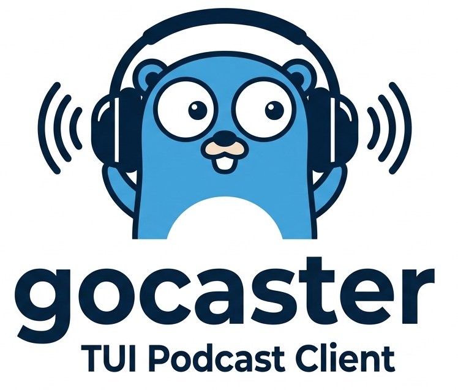
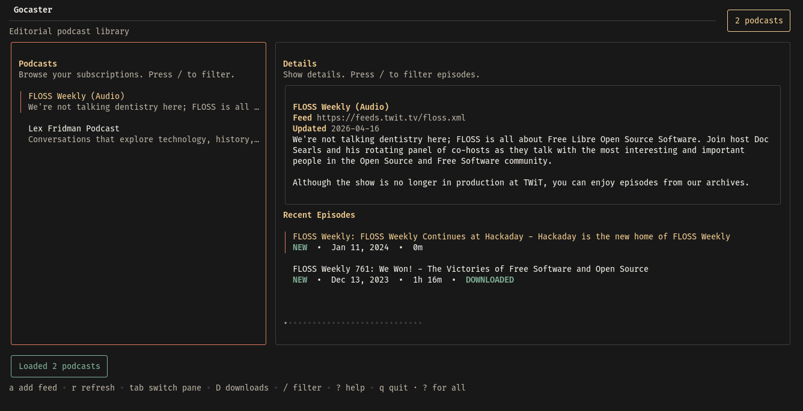

# Gocaster



Gocaster is a lightweight, terminal-based podcast client written in Go using the Bubble Tea TUI framework.

This repository contains the application, adapters for persistence and playback, and a Bubble Tea-based TUI so you can browse, subscribe, and play podcast episodes from your terminal.

## Screenshot



## Key highlights

- Terminal UI (TUI) built with charm.land/bubbletea
- RSS/Atom feed parsing via github.com/mmcdole/gofeed
- SQLite persistence (github.com/mattn/go-sqlite3)
- MPV adapter for audio playback (using go-mpv bindings; mpv must be installed separately)
- MPRIS support for desktop media controls (Linux)
- Download queue with episode downloading
- Clean architecture: domain, application, infrastructure, interface layers

## Contents

- cmd/gocaster/ - application entrypoint and dependency wiring
- internal/domain/ - core entities and port interfaces (Podcast, Episode, Repository, Player)
- internal/application/ - services / use-cases (PodcastService, PlayerService)
- internal/infrastructure/ - adapters: sqlite persistence, mpv player, RSS fetcher
- internal/interface/tui/ - Bubble Tea UI implementation and components

## Quick start

### Prerequisites

- Go 1.18+
- mpv (optional for audio playback)

### Build and run

- Build the binary: make build (writes to bin/gocaster)
- Run the app: make run
- Run with debug logging: make debug-run (writes debug.log)

### Testing and quality

- Run tests: make test
- Run tests with coverage: make test-coverage (produces coverage.html)
- Lint: make lint
- Format: make format
- Vet: make vet
- Full quality check: make check

### Configuration

Gocaster reads configuration from a TOML file. The default config file location is:

- Linux: `~/.config/gocaster/gocaster.toml` (or `$XDG_CONFIG_HOME/gocaster/gocaster.toml` if set)

If the config file doesn't exist, it will be created automatically with default values.

**Config options:**

| Option          | Default                               | Description                     |
| --------------- | ------------------------------------- | ------------------------------- |
| `database_path` | `~/.local/state/gocaster/gocaster.db` | Full path to SQLite database    |
| `download_path` | `~/.local/state/gocaster/downloads`   | Full path to download directory |

**Example config:**

```toml
database_path = "/home/user/my-podcasts.db"
download_path = "/home/user/Downloads/Podcasts"
```

You can use `~` in paths (e.g., `~/Downloads`), which will be expanded to your home directory.

If a path is not absolute (after resolving `~`), the default will be used and a warning will be logged.

- MPV: ensure mpv is installed and available in PATH for the MPV player adapter to work. If you prefer another player, implement the Player domain port and wire it in cmd/gocaster.

## Architecture notes

Gocaster follows dependency inversion: domain interfaces define behavior; application services orchestrate use-cases; infrastructure implements ports and the TUI is an adapter. This makes swapping persistence or player adapters straightforward.

## Contributing

- Bug reports and feature requests: please open an issue.
- Pull requests: fork, create a branch, and open a PR with a clear description and tests where appropriate.
- Coding style: follow gofmt and run `make lint` before submitting.

## License

This project is released under the MIT License. See LICENSE for details.

## Acknowledgements

- Bubble Tea, Bubbles and Lipgloss for the TUI stack
- gofeed for RSS/Atom parsing

If you have questions or would like help extending the project (new player backend, alternate persistence, or UI enhancements), open an issue or PR — contributions are welcome!
